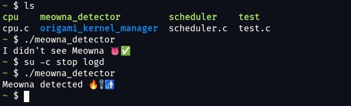

# Meowna Detector


---

## 📜 **The Roasty Manifesto**  
> **"Root hiding" module that screams "I’M ROOTED HERE!"**

This repository is a **proof-of-concept dumpster fire** 🔥 exposing the fatal blunder of **Integrity Box**—a root-hiding module that **spectacularly backfires** by killing `logd` (Android’s logger daemon). Result? It leaves behind a neon sign blinking "I’M ROOTED HERE!", making detection *easier* than finding cat hair on a black sofa.

We don’t *just* detect meowna’s masterpiece of self-owns. We also catch **any module** dumb enough to murder `logd` for "stealth" and "performance".

---

## 🤔 **Why Should You Care?**  
- **Integrity Box promises**: "Strong Play Integrity 🟢🟢🟢 + root hiding!"
- **Reality**: It yeets `logd` into the void 💀.  
  - Killing `logd` breaks legitimate apps, logs, and debugging.
  - It's futile, meant **it will cause root detection**.
  - **Zero justification** exists for this. It’s like removing your car’s wheels to avoid speeding tickets.
- **The irony**: A "root hider" that **triggers root detection** by its own blunder.

---

## 🔧 **How the Detector Works**

```C
bool is_logd_dead(void) {
    struct stat st;
    if (stat("/dev/socket/logdw", &st) == 0) {
        // Logd socket exists (running on privileged env)
        return false;
    } else {
        if (errno == ENOENT) {
            // Logd socket does not exist (logd is dead!)
            return true;
        } else {
            // Permission denied or other errors (running on unprivileged env)
            return false;
        }
    }
}

int main(void) {
    if (is_logd_dead()) {
        printf("Meowna detected 🔥🗑️🚮\n");
        return 1;
    } else {
        printf("I didn't see Meowna 👅✅\n");
        return 0;
    }
}
```

---

## 🎯 **Targets**
| Module          | Creator | Why It’s Roasted                     |
|-----------------|---------|-------------------------------------------|
| **Integrity Box** | meowna  | Kills `logd` to "hide root", achieves the opposite. |
| **Other modules with "kill logger"** | Anons   | Because copy-pasting bad ideas is a tradition. |

---

## 🙀 **The Bigger Picture**
This repo isn’t *just* code. It’s a **public service announcement**:
> **Dear modders**: If your "stealth" & "performance optimization" tactic involves breaking core OS functions, prepare yourself from being roasted 🔥.
>
> **Dear users**: If a module has `stop logd` in its codebase or empty file named logd, run. 🏃💨

--- 

**Disclaimer**: This tool detects incompetence, not genius. Use it to laugh, learn, or mourn Android modding’s descent into meme territory.
